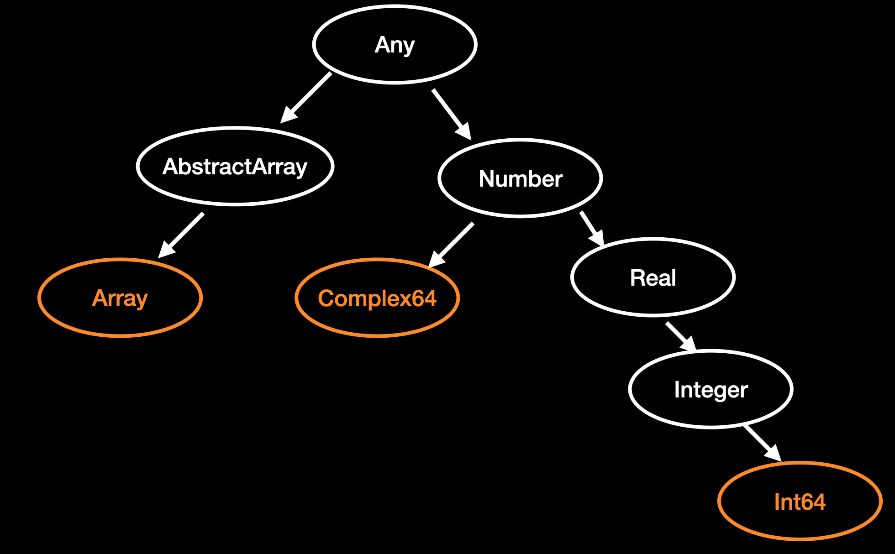

## 数据类型继承关系

- 具体类型不能被继承，可以实例化，对应图中橙色部分，只能作为叶子节点
- 抽象类型可以被继承，不能实例化，对应图中白色部分，可以往下连接节点

Julia中没有class，也没有子类型的继承关系，所有具体类型都是最终的，并且只有抽象类型可以作为其超类型。Julia中的继承是继承行为，而不是继承结构。

和 Mathematica 一样，Julia 不支持面向对象，不能继承方法。但面向对象的很多功能，可以用结构体及多重派发替代。